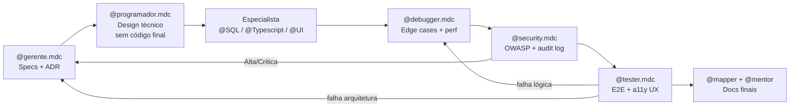
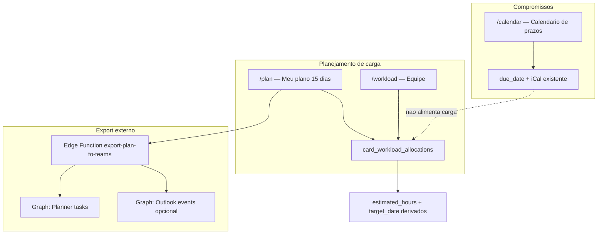

# E.2 — Plano diário 15 dias + UX drag + export Teams (Graph)

**Guia+Plano lidos** | spec nova: [`docs/50-components/workload-daily-planning.md`](docs/50-components/workload-daily-planning.md) + [`docs/50-components/teams-graph-export.md`](docs/50-components/teams-graph-export.md) | escopo: **MVP E.2** (planejamento + DnD) + **MVP Graph** (export one-way)

---

## Pipeline de agentes (obrigatório por fase)

Cada fase E.2.x só avança após handoff explícito entre personas. **Nenhum agente pula etapas.**



### @programador.mdc — Tech Lead (design + delegação)

**Não escreve código final.** Por fase, produz design executável e delega **um especialista por vez**:

| Fase | Entrega do Programador | Delegação |
|------|------------------------|-----------|
| E.2.0 | Mapa de impacto (módulos, RLS, contratos) | — (specs com Gerente) |
| E.2.1 | Contratos RPC + schema + índices + políticas RLS | `@SQL.mdc` |
| E.2.2 | Interface `PlanGridData`, actions server, hooks DnD | `@Typescript.mdc` |
| E.2.3 | Wireframes → componentes presentacionais | `@UI.mdc` (após TS estabilizar props) |
| E.2.4 | Extensão loader workload + props drawer | `@Typescript.mdc` → `@UI.mdc` |
| E.2.5 | Fluxo OAuth, token storage, payload Graph | `@Typescript.mdc` (Edge Functions) |

**Handoff obrigatório após cada delegação:**
> "Design Técnico Concluído. @[ESPECIALISTA].mdc — implemente exatamente: [arquivo/função]. Contrato: [entrada/saída]. Restrições: [lista]. Ao concluir, acione @debugger.mdc."

**Contratos-chave a especificar (E.2.2):**

```typescript
// lib/plan/types.ts — Programador define, Typescript implementa
interface PlanGridDay { date: string; capacityHours: number; allocatedHours: number; utilizationPct: number }
interface PlanGridRow { cardId: string; boardName: string; title: string; cells: Record<string, number> }
interface PlanGridData { days: PlanGridDay[]; rows: PlanGridRow[]; unscheduled: PlanGridRow[] }
```

---

### @UI.mdc — Apresentação pura (markup + Tailwind + a11y)

**Isolamento:** sem lógica de estado, fetch ou persistência. Recebe props do layer Typescript.

| Componente | Responsabilidade UI | Requisitos |
|------------|---------------------|------------|
| `plan-grid.tsx` | Grade 15 colunas, heat utilização, barras de card | Mobile-first: scroll horizontal `overflow-x-auto`; sticky coluna card |
| `plan-day-header.tsx` | Cabeçalho dia + % utilização | `aria-label` por coluna |
| `plan-sidebar.tsx` | Listas Teams-style (não agendados, sem estimativa, atrasados) | Semântica `<aside>` + `<section>` |
| `plan-allocation-cell.tsx` | Célula horas (visual disabled vs editável) | Focus ring, contraste WCAG AA |
| `plan-export-teams-button.tsx` | Botão + dropdown escopo | Estados loading/error |
| `workload-15d-grid.tsx` | Variante read-only gerente | Reutiliza tokens de `plan-grid` |

**Distinção visual vs `/calendar`:** accent planning (violeta workload), ícone `CalendarClock`, tipografia compacta para 15 colunas.

**Handoff obrigatório:**
> "Interface e Estilização Concluídas. @tester.mdc, valide responsividade e acessibilidade visual."

**Checklist a11y (UI entrega ao Tester):**
- [ ] Drag handles com `aria-grabbed` / instrução screen reader
- [ ] Navegação Tab entre células editáveis
- [ ] Cores semáforo não são único indicador (texto + ícone)
- [ ] Sidebar colapsável em viewport `< md`

---

### @debugger.mdc — Revisão pós-implementação

Acionado **após cada especialista**, antes de Security. Foco E.2:

| Área | Edge cases obrigatórios |
|------|-------------------------|
| Alocações | Timezone noon UTC; `hours=0` remove linha; soma > 24h/dia bloqueada |
| Drag DnD | Rollback optimistic em 403; drop inválido; ghost durante drag |
| Rollup | Card legado sem alloc + `estimated_hours` manual; reassign muda `user_id` |
| Concorrência | Duas abas editando mesma célula; Realtime merge conservador |
| Performance | 50+ cards × 15 dias sem jank; `DragOverlay` desmontado corretamente |
| Graph export | Re-export idempotente; token expirado mid-export; partial failure |

**Handoff obrigatório:**
> "Debugging e Otimização Concluídos. @security.mdc, realize auditoria profunda."

Se falha arquitetural: devolver `@programador.mdc` ou `@gerente.mdc` com local exato.

---

### @security.mdc — AppSec (pós-debugger, pré-tester)

Auditoria **obrigatória** ao fim de E.2.1, E.2.3, E.2.4 e E.2.5.

| Severidade | Vetor E.2 | Ação |
|------------|-----------|------|
| **Crítica** | Token OAuth Microsoft no cliente ou logs | Reportar + **parar**; aguardar aprovação PO |
| **Crítica** | IDOR: `get_plan_grid` retorna dados de outro membro sem role manager | Reportar + aguardar |
| **Crítica** | SQL injection via `work_date` / params RPC | Reportar + aguardar |
| **Alta** | Escalada: viewer escreve allocation via RPC bypass | Reportar + aguardar |
| **Alta** | `AZURE_CLIENT_SECRET` em `.env.local` commitado | Reportar + aguardar |
| **Média** | CSRF OAuth callback — validar `state` + PKCE | Corrigir autonomamente |
| **Média** | Rate limit ausente em export Graph | Corrigir autonomamente |
| **Baixa** | Headers CSP em callback route | Corrigir autonomamente |

**Entregáveis Security:**
- Atualizar [`docs/security_audit_log.md`](docs/security_audit_log.md) (gitignored)
- Confirmar entrada em [`.gitignore`](.gitignore)
- pgTAP cobre RLS negativa (user A ≠ user B)

**Handoff obrigatório:**
> "Auditoria e Correções de Segurança Finalizadas e Documentadas. Handoff para QA: @tester.mdc."

---

### @tester.mdc — QA E2E + UX

Acionado após Security green. Escreve/executa testes e valida ergonomia.

| Suite | Arquivo | Cenários |
|-------|---------|----------|
| Unit | `lib/plan/rollup.test.ts`, `move-allocation.test.ts` | Soma, move, fallback legado |
| E2E plan | `e2e/plan-dnd.spec.ts` | Sidebar→dia, entre dias, resize, inline edit, viewer blocked |
| E2E workload | `e2e/workload-15d.spec.ts` | Toggle semana/15d, drill-down read-only |
| E2E export | `e2e/plan-export-teams.spec.ts` | Mock Graph; toast sucesso |
| A11y | manual + axe no `/plan` | Tab order, contraste, screen reader labels |

**Roteamento de falhas:**
- Sintaxe / perf / edge case execução → `@debugger.mdc`
- Regra negócio / contrato API / RLS errado → `@gerente.mdc`

**Handoff obrigatório (sucesso):**
> "Testes E2E e Validação Concluídos com Sucesso. @mapper.mdc e @mentor.mdc, atualizem documentação."

---

## Contexto e oportunidade

Pesquisa de mercado (Asana/ClickUp/Teams Planner):

- **Três camadas separadas** é o padrão: prazos (`due_date`), carga operacional por dia (task-level), staffing estratégico (projeto/%).
- **Teams Planner Schedule**: grade dia-a-dia, sidebar de tarefas não agendadas, drag sidebar → calendário para definir start/due; buckets no board com drag.
- **Microsoft retirando iCal do Planner (jan-fev/2026)** — o Planner já mantém [`docs/00-product/competitive-voc.md`](docs/00-product/competitive-voc.md) iCal nativo; export Graph complementa (não substitui) nosso feed existente em [`apps/web/lib/ical.ts`](apps/web/lib/ical.ts).

Estado atual no código:

| Rota | Função | DnD |
|------|--------|-----|
| [`/calendar`](apps/web/app/(app)/calendar/page.tsx) | Prazos mensais org (`due_date`) | Não |
| [`/workload`](apps/web/app/(app)/workload/page.tsx) | Carga semanal gerente | Não |
| Board calendar | `target_date ?? due_date` | Spec D, não implementado |

Referência DnD: [`board-kanban-view.tsx`](apps/web/components/board/board-kanban-view.tsx) (`DndContext`, optimistic + rollback).

---

## Arquitetura de produto (3 superfícies)



| Superfície | Sidebar | Quem vê | Edita |
|------------|---------|---------|-------|
| `/calendar` | Calendário (existente) | Todos | `due_date` |
| `/plan` | **Meu plano** (novo) | Todos com cards assignee | Próprias alocações + drag |
| `/workload` | Carga (evoluir) | Manager+ / board manager | Capacidade; carga read-only v1 |

**Regra:** `/calendar` nunca edita horas de carga. `/plan` nunca altera `due_date` (só leitura como referência visual).

---

## Modelo de dados

### Nova tabela (fonte única de alocação diária)

```sql
card_workload_allocations (
  id uuid PK,
  org_id uuid NOT NULL,
  card_id uuid NOT NULL REFERENCES cards,
  user_id uuid NOT NULL,
  work_date date NOT NULL,
  hours numeric(4,2) NOT NULL CHECK (hours >= 0 AND hours <= 24),
  UNIQUE (card_id, user_id, work_date)
)
```

- RLS: isolamento `org_id`; **write** = `user_id = auth.uid()` (assignee do card).
- Índices: `(org_id, user_id, work_date)`, `(org_id, work_date)`.

### Rollup no card (via RPC, não edit manual conflitante)

| Campo | Derivação |
|-------|-----------|
| `estimated_hours` | `SUM(allocations)` do assignee; fallback legado se zero linhas |
| `target_date` | `MAX(work_date WHERE hours > 0)` ou override explícito no drawer |
| `due_date` | Inalterado — prazo final, iCal, overdue |

### RPCs novos

| RPC | Função |
|-----|--------|
| `upsert_card_allocation(card_id, work_date, hours)` | Célula; recalcula rollup |
| `move_card_allocations(card_id, from_date, to_date, hours?)` | Suporte ao drag entre dias |
| `bulk_spread_card_hours(card_id, total, start, end)` | Atalho even-split (ClickUp-style) |
| `get_plan_grid(org_id, user_id, from, to)` | Grade 15d + capacidade + utilização |

MV [`workload_by_member_week`](docs/50-components/workload-capacity.md): passar a somar alocações diárias dentro da semana ISO (substituir dump na âncora).

### Tabela de vínculo Graph (export)

```sql
org_teams_integrations (
  org_id uuid PK,
  azure_tenant_id text,
  team_id text,
  channel_id text,
  planner_plan_id text,
  planner_bucket_id text,
  configured_by uuid,
  created_at timestamptz
)

teams_export_mappings (
  id uuid PK,
  org_id uuid,
  card_id uuid,
  planner_task_id text,
  last_exported_at timestamptz,
  UNIQUE (org_id, card_id)
)
```

Tokens OAuth Microsoft: **somente server-side** (Edge Function + Supabase vault/encrypted column) — alinhado ao [`GUIA_MESTRE.md`](docs/GUIA_MESTRE.md).

---

## UX `/plan` — inspiração Teams Planner

### Layout

```
[← Hoje →]  7 jul — 21 jul 2026                    [Exportar p/ Teams ▼]

Capacidade   8h   8h   8h  ...  8h     │ Util 62% 88% ...
─────────────────────────────────────────────────────────────
▸ Projeto Alpha
  [==== Card API login ====]  2h  4h  -  ...        Σ 6h
  [== Testes E2E ==]           -   -  3h  ...        Σ 5h
─────────────────────────────────────────────────────────────
Sidebar direita (Teams-style):
  • Não agendados (sem start/target)
  • Sem estimativa
  • Atrasados (due_date < hoje)
  [+ Alocar card existente]
```

- Janela: **15 dias rolling**; navegação `?start=YYYY-MM-DD` (reutilizar padrão de [`workload-week-nav.tsx`](apps/web/components/workload/workload-week-nav.tsx)).
- Agrupamento por board/projeto (read-only); subtotal por board.
- Heat de utilização diária via [`utilization.ts`](apps/web/lib/workload/utilization.ts).
- Visual distinto do `/calendar`: accent "planning", ícone `CalendarClock` ou `LayoutGrid` em [`app-sidebar.tsx`](apps/web/components/shell/app-sidebar.tsx).

### Interações drag (dnd-kit — reutilizar padrão Kanban)

| Gesto | Comportamento | Persistência |
|-------|---------------|--------------|
| Sidebar → célula dia | Card ganha `target_date` + alocação default (ex. 4h ou spread) | `upsert_card_allocation` + `update_card_fields` |
| Card entre dias | Move bloco de horas ou `target_date` | `move_card_allocations` |
| Resize barra horizontal no card | Altera `start_date` ↔ `target_date`; redistribui horas nos dias úteis | `bulk_spread_card_hours` |
| Drag "pill" de horas entre células | Move N horas de D1 → D2 | `move_card_allocations` |
| Click célula vazia | Input numérico inline (0–24h) | `upsert_card_allocation` |
| Drag card → outro membro | **Fast-follow** (gerente) | Reassign + realocar |

Implementação técnica:

- `useDroppable({ id: "2026-07-08" })` por coluna-dia.
- `useDraggable` por card/pill (padrão [`sortable-card-tile.tsx`](apps/web/components/board/sortable-card-tile.tsx)).
- Optimistic map `dayIso → allocations[]` + rollback em 403 (field permissions F.2).
- Persist via [`field-actions.ts`](apps/web/app/(app)/boards/[boardId]/field-actions.ts) + novos server actions em `plan/actions.ts` (`"use server"` obrigatório).

### Qualidade de vida

- Teclado: Tab entre células, Enter confirma, Esc cancela.
- Atalho "Distribuir X h" entre start e target (modal).
- Badge no drawer: mini heatmap 15d + link "Abrir em Meu plano".
- Cards legado (só `estimated_hours`, sem alloc): fallback even-split start→target (paridade ClickUp) até usuário granularizar.

### Integração drawer

Seção **"Plano de trabalho"** em [`card-drawer.tsx`](apps/web/components/board/card-drawer.tsx):

- Total derivado; bloquear edição direta de `estimated_hours` quando existem alocações ativas.
- Link deep: `/plan?highlight={cardId}`.

---

## UX `/workload` — evolução gerente

Toggle **Semana | 15 dias**:

- Modo 15d: linhas = membros; expand = cards; células = soma horas (read-only v1).
- Drill-down por membro+dia (evoluir [`workload-drilldown.tsx`](apps/web/components/workload/workload-drilldown.tsx)).
- Permissões inalteradas: [`canViewWorkload`](apps/web/lib/workload/permissions.ts).

---

## Export Microsoft Teams (Graph API) — escolha confirmada

### Limitações documentadas (spec obrigatória)

- Graph Planner API: **somente planos basic**; Premium não exposto ([Microsoft Learn](https://learn.microsoft.com/en-us/graph/api/resources/planner-overview)).
- Planner Schedule é **nível dia**, não slot horário — alocações horárias exportam como:
  - **Modo A (default):** 1 task Planner por card (`title`, `startDateTime`, `dueDateTime`, assignee por email).
  - **Modo B (opcional):** 1 evento Outlook por dia alocado (`subject`, `start/end` com duração = horas) — melhor para blocos de trabalho.
- Export **one-way MVP**; sync bidirecional = fast-follow.
- Requer consentimento admin Azure AD para permissões delegadas.

### Permissões Graph (delegated)

| Permissão | Uso |
|-----------|-----|
| `Tasks.ReadWrite` | Criar/atualizar Planner tasks |
| `Group.Read.All` | Listar plans do grupo Teams |
| `Calendars.ReadWrite` (opcional) | Modo B — eventos Outlook |
| `User.Read` | Identidade conectada |

### Fluxo UX

1. **Org admin** (Settings → Integrações): conecta tenant, seleciona Team/Channel/Plan/Bucket (picker via Graph).
2. **Membro** em `/plan`: botão **"Exportar para Teams"** → escolhe escopo (cards selecionados | plano 15d completo) + modo (Planner task | Outlook blocks).
3. Edge Function `export-plan-to-teams`:
   - Valida token Microsoft do usuário (refresh server-side).
   - Mapeia cards → `POST /planner/tasks` ou `POST /me/events`.
   - Grava `teams_export_mappings` para re-export idempotente (update vs create).
4. Feedback: toast com link deep para task Planner / evento Outlook.

### Arquivos previstos

| Peça | Caminho |
|------|---------|
| Spec export | `docs/50-components/teams-graph-export.md` |
| ADR | `docs/20-architecture/ADR-0012-microsoft-graph-teams-export.md` |
| Edge Function | `supabase/functions/export-plan-to-teams/index.ts` |
| OAuth callback | `supabase/functions/microsoft-oauth-callback/index.ts` |
| Settings UI | `apps/web/app/(app)/settings/integrations/teams/page.tsx` |
| Botão export | `apps/web/components/plan/plan-export-teams-button.tsx` |

**Segredos:** `AZURE_CLIENT_ID`, `AZURE_CLIENT_SECRET` — somente Edge Functions / env server.

---

## Conflitos de spec a resolver na escrita

| Spec existente | Conflito | Resolução E.2 |
|----------------|----------|---------------|
| [`views-interactive.md`](docs/50-components/views-interactive.md) L60: calendar drag → `due_date` | Board calendar vs org planning | Board calendar: drag `target_date`; org `/calendar`: mantém `due_date` |
| [`workload-capacity.md`](docs/50-components/workload-capacity.md) | Sem alocação diária | Estender com seção E.2 + link para spec filha |

---

## Faseamento e gates SDD

| Fase | Entrega | Gate | Agentes (ordem) |
|------|---------|------|-----------------|
| **E.2.0** | Specs + ADR aprovados | Sem código | Gerente |
| **E.2.1** | Migration + RPC + pgTAP | CI verde | Programador → SQL → Debugger → Security |
| **E.2.2** | `/plan` grid 15d + inline + sidebar | Vitest rollup | Programador → Typescript → UI → Debugger → Security |
| **E.2.3** | DnD completo | Playwright drag | Typescript → UI → Debugger → Security |
| **E.2.4** | `/workload` 15d + drawer | E2E gerente | Typescript → UI → Debugger → Security |
| **E.2.5** | Graph OAuth + export | EF + tenant QA | Programador → Typescript → Debugger → Security |
| **E.2.QA** | Suíte completa + audit log | Tester green | Tester → Mapper/Mentor |
| **Fast-follow** | Outlook, cross-assignee drag, sync | Fora MVP | Gerente replaneja |

---

## Critérios de aceite (MVP)

**Planejamento**
- [ ] Assignee aloca 4h em D+2; `/plan` e `/workload` 15d refletem após refresh.
- [ ] Drag sidebar → dia cria alocação + `target_date`.
- [ ] Drag entre dias move horas; resize barra redistribui no intervalo.
- [ ] `estimated_hours` = soma alocações; edição direta bloqueada quando há alloc.
- [ ] `/calendar` e iCal inalterados (`due_date` only).
- [ ] Viewer: sidebar visível, células disabled, RPC 403.

**Graph export**
- [ ] Org admin configura Team/Channel/Plan uma vez.
- [ ] Usuário conecta conta Microsoft; exporta 15d → tasks aparecem no Planner do canal.
- [ ] Re-export atualiza task existente (idempotente via `teams_export_mappings`).
- [ ] Tokens nunca expostos ao cliente.

**Testes + agentes**
- [ ] pgTAP: RLS allocations + org isolation (Security valida).
- [ ] Vitest: rollup, move_allocations, fallback legado (Tester).
- [ ] Playwright: `plan-dnd.spec.ts`, `plan-export-teams.spec.ts` (Tester).
- [ ] Checklist a11y UI concluído (UI → Tester).
- [ ] `security_audit_log.md` atualizado pós E.2.5 (Security).

---

## Matriz Spec → Código → Teste → Agente

| Requisito | Código | Teste | Agente owner |
|-----------|--------|-------|--------------|
| Allocations table | `*_card_workload_allocations.sql` | pgTAP | SQL |
| Plan grid loader | `lib/load-plan-grid.ts` | Vitest | Typescript |
| `/plan` page | `app/(app)/plan/page.tsx` | Playwright | Typescript + UI |
| DnD grid | `components/plan/plan-grid.tsx` | Playwright | Typescript + UI |
| Sidebar unscheduled | `components/plan/plan-sidebar.tsx` | Playwright | UI |
| Workload 15d | `workload-table.tsx` + loader | E2E | Typescript + UI |
| Drawer resumo | `card-drawer.tsx` | E2E | Typescript + UI |
| Graph export | `export-plan-to-teams` EF | Integration mock | Typescript + Security |
| Sidebar nav | `app-sidebar.tsx` | Visual/a11y | UI |
| OAuth tokens | Edge Function vault | Security audit | Security |

---

## Riscos

| Risco | Mitigação |
|-------|-----------|
| Graph API muda com update Planner 2026 | Spec cita versão v1.0; feature flag por org |
| Conflito estimated_hours vs allocations | RPC única; UI bloqueia dual edit |
| DnD + Realtime (spec D) | Lock por célula ativa; merge conservador |
| Premium Planner sem API | Documentar; fallback Modo B Outlook |
| Complexidade OAuth enterprise | Gate separado E.2.5; admin setup wizard |
| Agente pula Security | Gate explícito na tabela de fases |

---

## Decisões travadas

1. Rota **`/plan`** ("Meu plano") — distinta de `/calendar`.
2. Fonte única: **`card_workload_allocations`**; card fields derivados.
3. Gerente **não edita** alocações de terceiros na v1.
4. Export Teams via **Microsoft Graph** (one-way); iCal nativo **mantido** (vantagem competitiva vs Planner 2026).
5. DnD no MVP de `/plan` — não adiar para fast-follow.
6. **Pipeline de agentes obrigatório:** Programador → Especialista → Debugger → Security → Tester — sem exceção.
