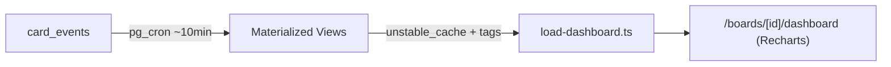

# Modelo de Analytics (Dashboard)

## Principio
Nunca agregar OLTP ao vivo por request. Event sourcing -> Materialized Views (pg_cron) -> cache Next.js (`unstable_cache` + tags).

## Fonte
`card_events` (append-only): `card_created`, `card_moved`, `card_completed`, `card_reopened`, `stage_changed`, etc.

## Metricas (por board, MVP)
- Throughput: cards `card_completed` por semana (`throughput_by_board_week`).
- Lead time: media de dwell entre movimentos (`cycle_time_by_card`).
- Gargalo: coluna com maior dwell medio.
- CFD: contagem por coluna no dia (`cfd_by_board_day`).

## Pipeline

## Cache (Next.js)
- Tags: `dashboard`, `dashboardBoard(boardId)` em `revalidation.ts`.
- Invalidacao via `revalidateDashboard(boardId)` apos mutacoes relevantes.

## Acesso
RPC `get_board_dashboard_bundle(p_board)` — `security definer` com `app.can_access_board` (nao expor `card_events` direto).

## Fast-follow
Rollup cross-board por org; export ClickHouse/Tinybird se analitica crescer.
