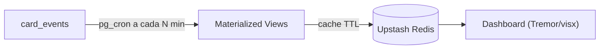

# Modelo de Analytics (Dashboard)

## Principio
Nunca agregar OLTP ao vivo por request. Event sourcing -> Materialized Views (pg_cron) -> cache Redis.

## Fonte
`card_events` (append-only): cada `created/moved/completed/...` com `from_column_id`, `to_column_id`, `created_at`, `actor_id`.

## Metricas (por board, MVP)
- Throughput: cards `completed` por semana.
- Lead time: `completed_at - created_at`.
- Cycle time por estagio: tempo entre entrada/saida de cada coluna (de eventos `moved`).
- Gargalo: coluna com maior dwell time medio / acumulo de WIP.
- CFD: contagem por coluna ao longo do tempo.
- Aging WIP: cards em progresso ha mais tempo; taxa de atraso (due_date < now e nao completo).

## Pipeline

## Chaves de cache (Redis)
- `org:{orgId}:board:{boardId}:dash:cfd` (TTL 300s)
- `org:{orgId}:board:{boardId}:dash:cycle` (TTL 300s)
- Invalidacao por evento via Realtime quando necessario.

## Fast-follow
Rollup cross-board por org; export para ClickHouse/Tinybird se a analitica crescer.
