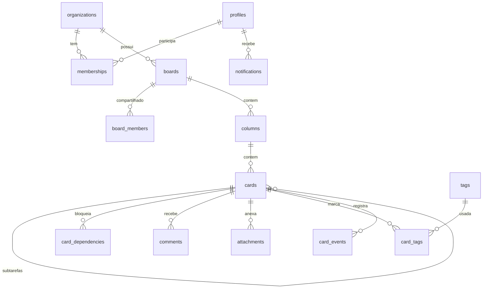

# ERD / Schema

Fonte de verdade do schema = migracoes em `supabase/migrations/`. Este doc descreve o alvo.

## Entidades

## Tabelas (alvo) e status de migracao
- organizations, profiles, memberships [0001 - implementado]
- boards, board_members, columns, cards, card_dependencies, card_events [0002 - implementado]
- tags, card_tags [0003 - implementado]
- comments, attachments [S4 - planejado]
- notifications [S5 - planejado]
- invitations, ical_feed_tokens [0004 - implementado]

## Convencoes
- PK uuid (`gen_random_uuid()`), `org_id` em toda tabela de tenant + indice.
- `created_at`/`updated_at timestamptz default now()`; trigger de `updated_at`.
- Ordenacao (`columns.position`, `cards.position`) = text com fractional indexing.
- Subtarefas: `cards.parent_id` -> cards (status/assignee proprios).
- Dependencias: `card_dependencies(blocker_card_id, blocked_card_id, type='finish_to_start')`.
- `card_events` append-only (sem update/delete) -> base de analytics + audit.

## Enums
- `membership_role`: admin | viewer
- `card_priority`: low | medium | high | urgent
- `card_event_type`: created | moved | updated | completed | reopened | assigned | due_changed | priority_changed | archived
