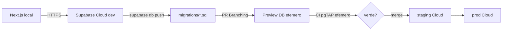

# Ambientes e Paridade

## Cadeia
local (Cloud) -> preview (por PR) -> staging -> producao. Mesmo conjunto de migracoes em todos.

## Fonte de verdade
Migracoes versionadas em `supabase/migrations/`. Nunca alterar schema manualmente no painel.

## Topologia (ADR-0002)

- **Frontend:** Next.js (`apps/web`) — `npm run dev` ou Vercel. Sem Postgres/Auth no mesmo host.
- **Backend:** Supabase Cloud (projeto dev/staging/prod separados).
- **CI:** `supabase start` efemero no GitHub Actions apenas para pgTAP (nao e dev do desenvolvedor).

## Fluxo


## Setup local (desenvolvedor frontend)

Ver runbook completo: [supabase-cloud-dev.md](supabase-cloud-dev.md).

Resumo:

```bash
supabase login
supabase link --project-ref <ref>
supabase db push
# seed via SQL Editor
npm run supabase:env
npm run dev
```

**Nao e necessario** Docker Desktop para desenvolver o app.

## Contribuidores de schema / CI

- pgTAP roda no CI com `supabase start` no runner (`.github/workflows/ci.yml`).
- Opcional local: Docker + `supabase start` + `supabase test db` antes de abrir PR.

## Gaps atuais

- pnpm/corepack indisponivel -> npm workspaces.

## Producao LAN (servidor Linux interno)

Runbook completo: [linux-lan-secure-deploy.md](linux-lan-secure-deploy.md).

Templates: `infra/nginx/`, `infra/pm2/`, `infra/env/`.
